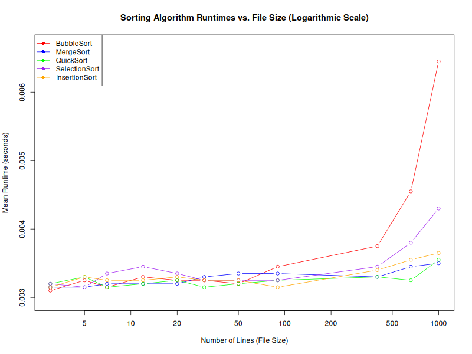

## Comparison between runtimes for different sorting algorithms. The sorted data consists of integers between 1 and 10000.

Measuring Single core implementeringar av sortings-algoritmer in programskpråket C:

cykomatisk komplexitet

tidskomplexitet

körtid i nanosekunder

verifiera tidskomplexitet med körtiden.

C kod kompileras direkt till assembly. 
Liten overhead. ->

Mätningarna på tidsåtgång är mer representativa på tidsåtgången av själva algoritmen

Hur mycket minne som går åt under sorteringen. Minnesanvändning. Finns funktioner i R. Seperat graf för detta.

Skript som generarar en fil med n st slumptal (integers, floats, strängar) som sätts in i en textfil
R scriptet kör detta inför varje testkörning

Kör m st körningar med de olika dataseten.
Confidensintervall