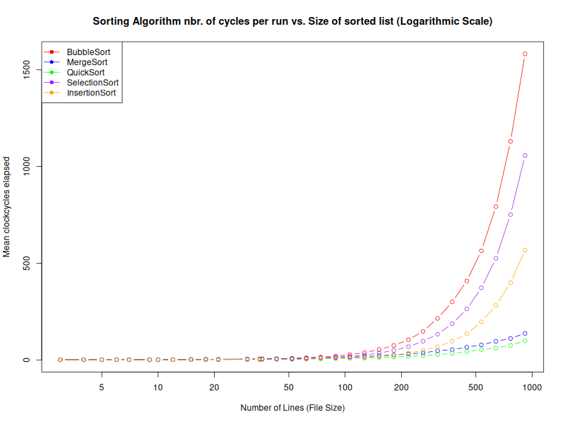

## Jämförelse mellan exekveringstider hos vanliga sorteringsalgoritmer vid olika stora datamängder. Den sorterade datan består av 4-siffriga heltal.

Bestämma tidskomplexiteten i medelfallet för olika sortingsalgoritmer

cykomatisk komplexitet

körtid i sekunder

verifiera tidskomplexitet med körtiden.

C kod kompileras direkt till assembly. 
Liten overhead. ->

Mätningarna på tidsåtgång är mer representativa på tidsåtgången av själva algoritmen

Hur mycket minne som går åt under sorteringen. Minnesanvändning. Finns funktioner i R. Seperat graf för detta.

Skript som generarar en fil med n st slumptal (integers, floats, strängar) som sätts in i en textfil
R scriptet kör detta inför varje testkörning

Kör m st körningar med de olika dataseten.
Confidensintervall
